# Procédure d'installation 

| | |
|---|---|
| **Version du document** | 1.0 |
| **Date** | 2026-08-16 |
| **Auteur** | Essotom |
| **Système cible** | Debian 13 « Trixie » (amd64) |
| **Durée de la procédure** | ~45 min |
| **Testé le** | 2026-08-16 - reconstruction complète OK |

---

## 1. Objet du document

Cette procédure permet de reconstruire intégralement le serveur `srv-meridian-01` à partir d'une machine vierge. Elle s'adresse à un administrateur système connaissant Linux mais découvrant cette infrastructure.

**Elle ne contient aucun récit, aucune tentative infructueuse, aucune explication de « pourquoi ».** Le raisonnement est dans `partitionnement.md` et `recherches.md`, les incidents dans `JOURNAL.md`. Ici, uniquement ce qu'il faut taper.

---

## 2. Conventions

| Symbole | Signification |
|---|---|
| `[HOTE]$` | Commande exécutée sur le poste physique |
| `[SRV]$` | Commande exécutée sur le serveur, compte non privilégié |
| `[SRV]#` | Commande exécutée sur le serveur, avec `sudo` |
| `<valeur>` | À adapter à ton contexte |


---

## 3. Prérequis

**Matériel**
- VirtualBox ou KVM/virt-manager

**Fichiers**

| Élément | Version | Empreinte SHA-256 |
|---|---|---|
| `debian-13.x.0-amd64-netinst.iso` | 13.x | `ce0eeee7b51fdcdbed1e5116668c1fee27e528767bdf488e5f115a67b225e5dfd0afca1d456aaa9408ceb6b8527521ff7b6b5d62fdbe6f8c5faaf8df56a9629` |

**Informations à préparer avant de commencer**

| Paramètre | Valeur retenue |
|---|---|
| Nom d'hôte | `srv-meridian-01` |
| Domaine | `meridian.lan` |
| IP d'administration | `192.168.56.10/24` |
| Compte administrateur | `essotom` |
| Schéma de partitionnement | voir `partitionnement.md` |

---

## 4. Vue d'ensemble

| Étape | Objet | Durée |
|---|---|---|
| 1 | Téléchargement de l'image | 5 min |
| 2 | Création de la machine virtuelle | 5 min |
| 3 | Installation du système de base | 20 min |
| 4 | Configuration réseau | <> |
| 5 | Comptes et élévation de privilèges | <> |
| 6 | Accès distant SSH | <> |
| 7 | Pare-feu | <> |
| 8 | Mises à jour automatiques | <> |
| 9 | Recette finale | 10 min |

---
## 5. Installation

### Étape 1 : Téléchargement de l'image d'installation

**objet**: Récupérer l'image ISO

Lien de téléchargement : [Télécharger Debian](https://www.debian.org/download)

---

### Étape 2 :  Création de la machine virtuelle

**Objet** - Provisionner la VM avec les ressources et les interfaces réseau attendues.

| Paramètre | Valeur |
|---|---|
| Nom | `srv-meridian-01` |
| vCPU | 2 |
| RAM | 2048 Mo |
| Disque | 30 Go |
| Interface 1 | enp0s3 |
| Interface 2 | enp0s8 |

**Provisionnement de la VM**

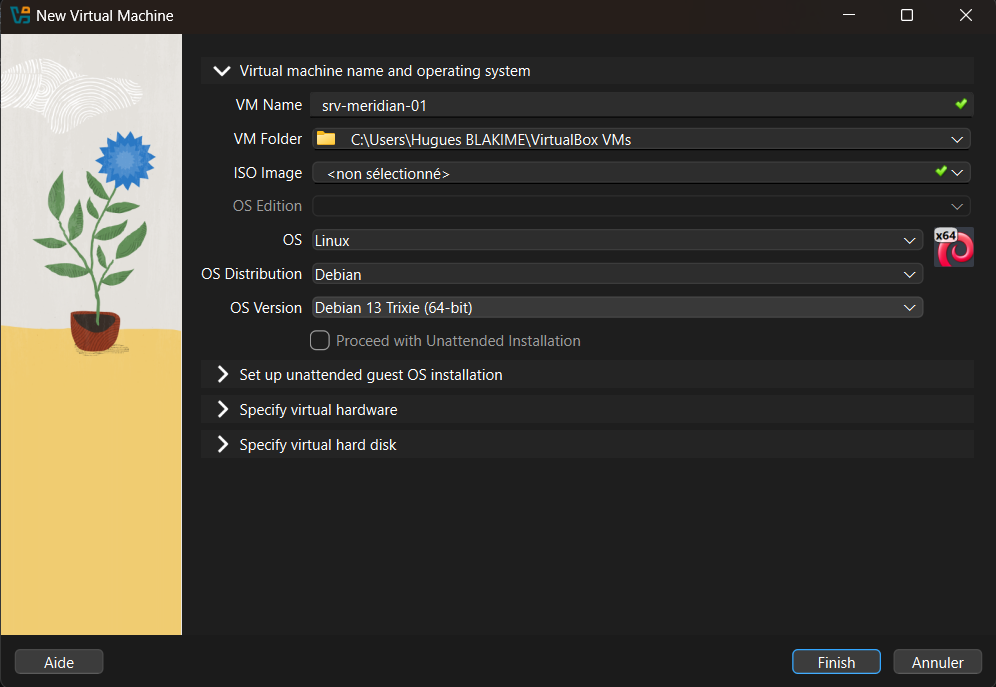
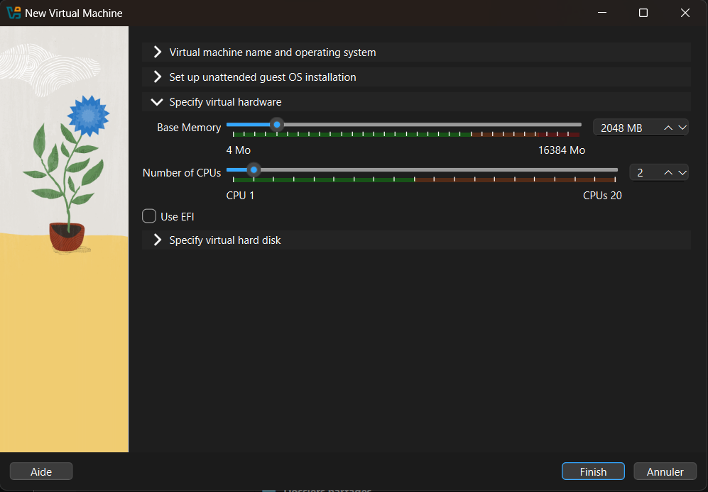
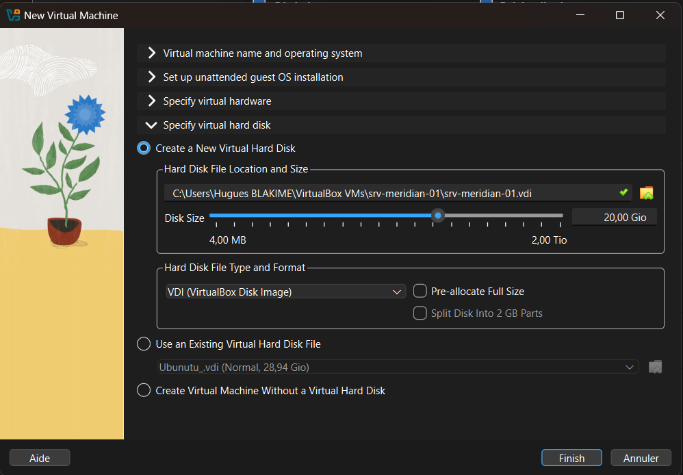
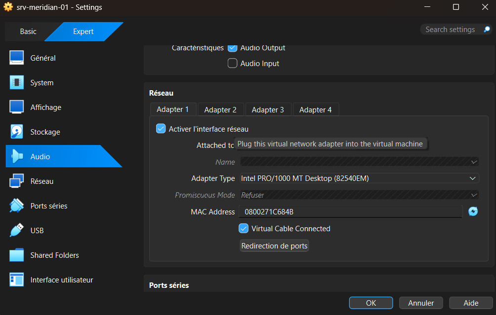
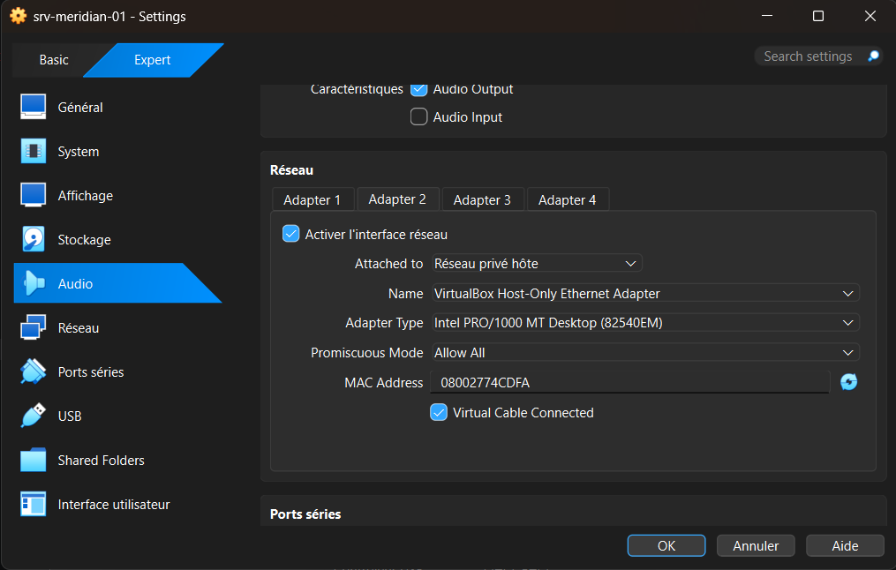

---

### Étape 3 : Installation de la machine virtuelle
**Configuration de base de la VM**

Pour commencer, nous allons configurer les paramètres de base de la machine virtuelle, notamment la langue d'affichage et la disposition du clavier. Nous sélectionnons ensuite la carte réseau configurée en mode NAT, qui sera utilisée pour établir la connexion réseau nécessaire à l'installation de Debian, comme le présente l'image ci-dessous.

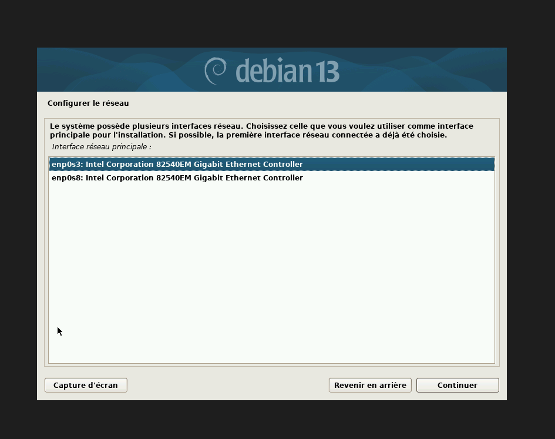

Ensuite nous allons configurer le nom du serveur et les informations concernant le nom de domaine.

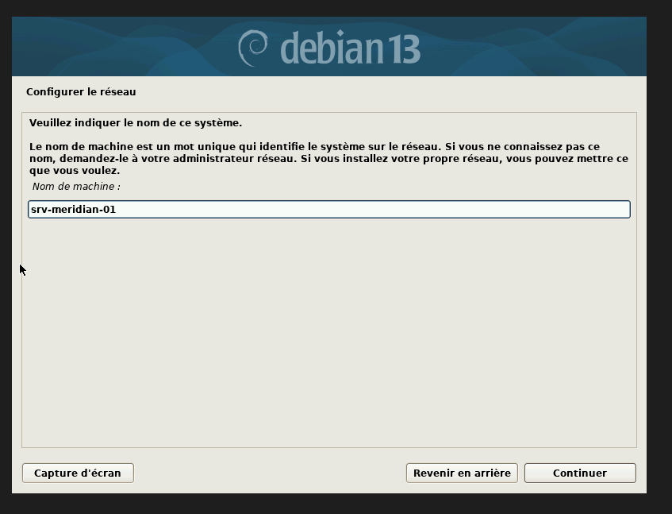
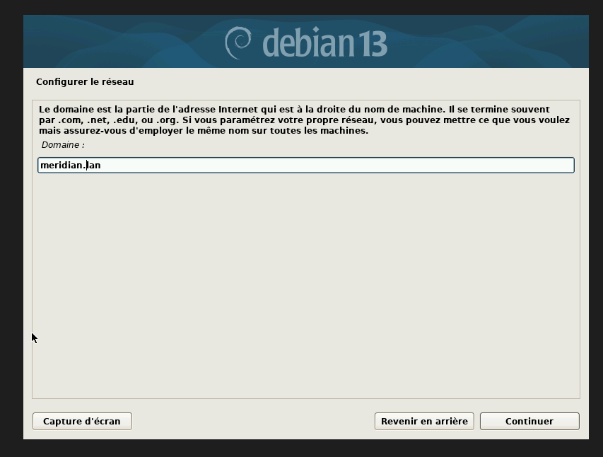
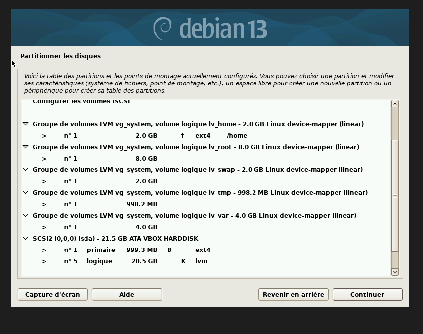

Pour clôturer cette étape nous avons configuré les informations du compte root et de l'utilisateur essotom.

**Partitionnement du disque**

Le projet fixe des exigences en matière de partitionnement du disque qui doivent être respectées. Voir [partitionnement.md](partitionnement.md) pour le détail du schéma retenu.

**Configuration de l'environnement et des utilitaires**

Une des exigences du projet est que le serveur ne dispose d'aucune interface graphique. Afin de respecter cette contrainte, seuls les utilitaires usuels du système ainsi que le service SSH ont été sélectionnés lors de l'installation. Cette configuration permet de disposer d'un système minimal, adapté à une utilisation en tant que serveur et administrable entièrement en ligne de commande.

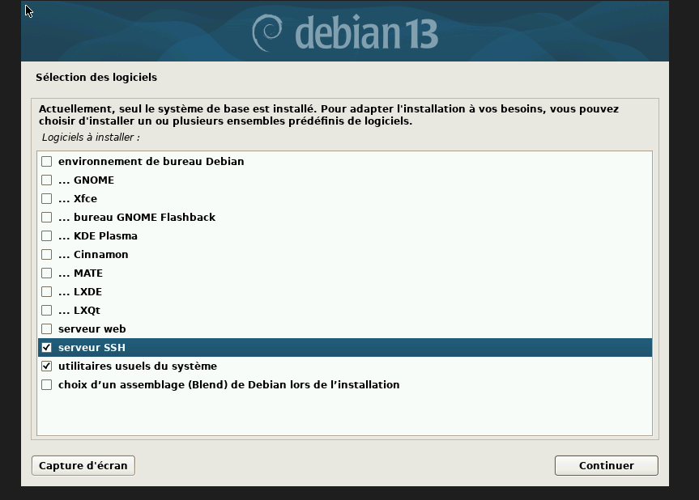

---

### Étape 4 : Ajout du compte nominatif dans le groupe sudo

Vu que nous avons configuré les informations du compte root, notre compte nominatif n'a pas été ajouté par défaut dans le groupe des sudoers. Il nous faut donc le faire manuellement. Pour ce faire, nous faisons d'abord une sauvegarde du fichier /etc/sudoers avant de le modifier.

**Backup du fichier /etc/sudoers**

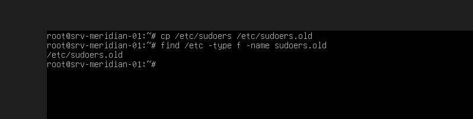

**Ajout du compte nominatif au groupe sudo**

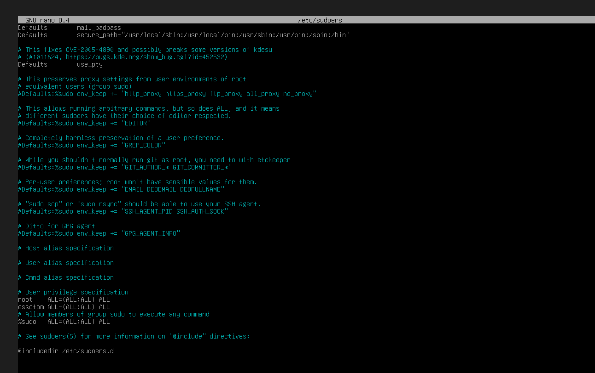

--- 

## 6. Configurations

### Étape 1 : Analyse

Notre serveur dispose de deux interfaces, une interface NAT qui permet la liaison avec Internet et une interface en host-only qui est reliée à notre réseau privé local.

L'interface NAT (enp0s3) doit être configurée en attribution d'adresse IP automatique via le DHCP. L'interface host-only doit avoir une adresse IP statique présente dans la plage de notre réseau local.

Le gestionnaire réseau actif sur notre système est **ifupdown**.

--- 

### Étape 2 : Configuration

Avec le gestionnaire ifupdown, la configuration est stockée dans le fichier **/etc/network/interfaces**. Après avoir sauvegardé ce fichier, nous pouvons alors procéder à sa modification.

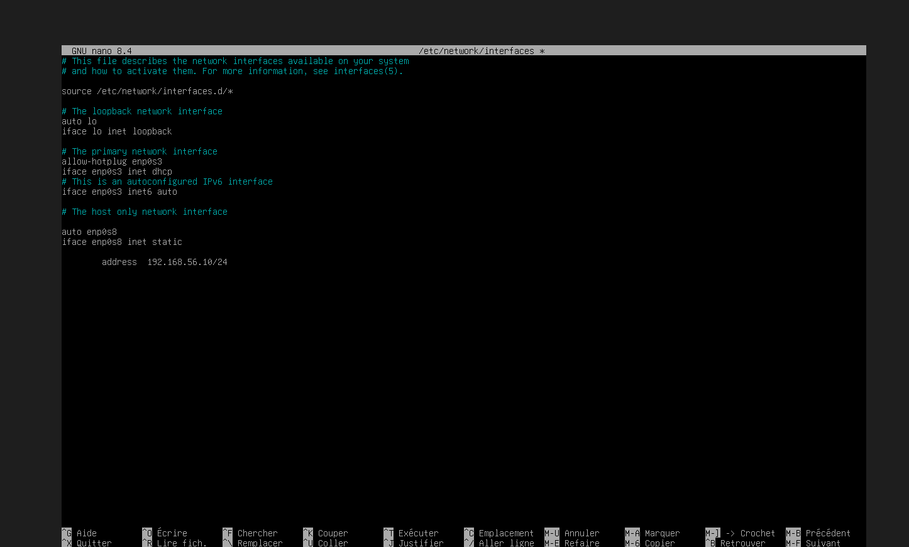

Ensuite nous avons rajouté notre domaine ainsi que l'IP du serveur dans le fichier /etc/resolv.conf et configuré le fichier /etc/hosts pour que le FQDN pointe vers l'IP statique du serveur.

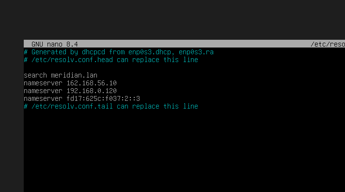

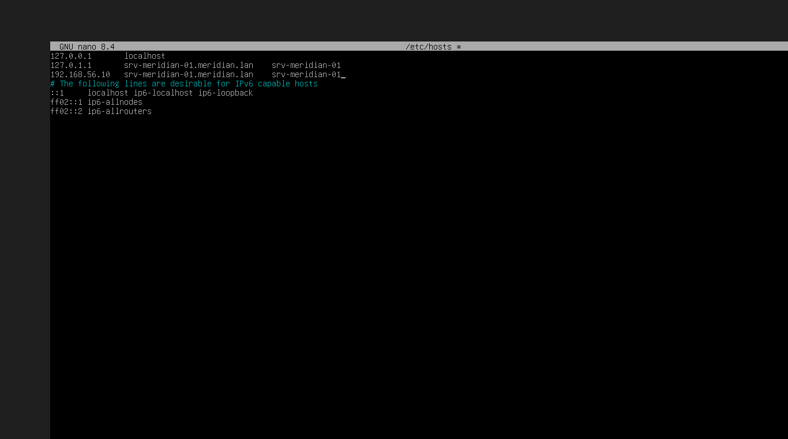

---

### Étape 3 : Durcissement de sudo 

- il faut d'abord éditer le fichier sudoers en passant par l'outil visudo

```bash
sudo visudo
```
puis on rajoute dans le fichier la ligne

```bash
Defaults    logfile="/var/log/sudo/log"
```
et on enregistre

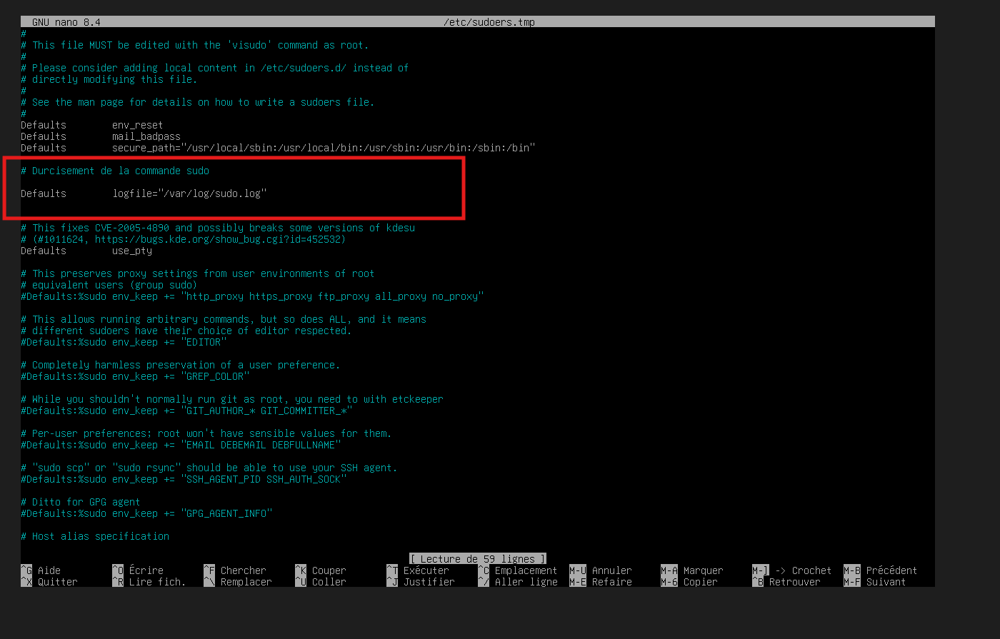

Pour tester, il nous suffit de lancer une commande qui nécessite une élévation de privilège et de regarder le contenu du fichier /var/log/sudo.log. On obtient alors :

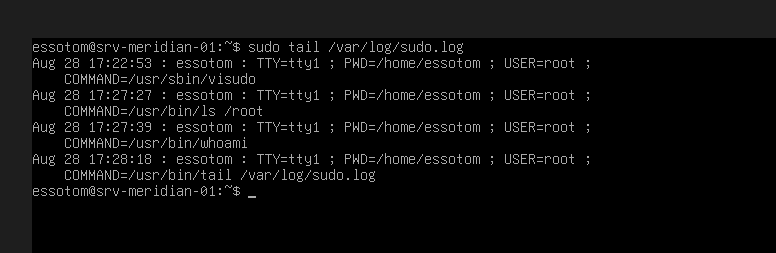

Pour aller plus loin, on peut faire en sorte que le fichier /var/log/sudo.log ne soit accessible que par les utilisateurs privilégiés. Il faut alors exécuter ces deux lignes :

```bash

sudo chown root:root /var/log/sudo.log
sudo chmod 600 /var/log/sudo.log

```

La première ligne permet d'attribuer le fichier /var/log/sudo.log à l'utilisateur et au groupe **root**. La deuxième ligne restreint les permissions pour que seul l'utilisateur root puisse lire et écrire dans le fichier en question.

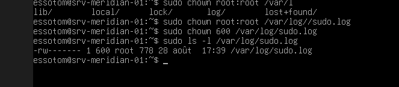

--- 

### Étape 4 : Accès distant SSH

Dans cette section nous allons attaquer l'exigence 5.5 liée à l'accès distant à notre serveur. Pour commencer voici le principe sur lequel notre approche se base 

#### Authentification SSH classique 

CLIENT                         SERVEUR
┌──────────────┐               ┌──────────────┐
│ mot de passe │ ────────────► │ vérification │
└──────────────┘               └──────────────┘

#### Authentification par paire de clé

CLIENT                              SERVEUR
┌─────────────────┐                ┌─────────────────┐
│ clé privée      │                │ clé publique    │
│                 │                │                 │
│ id_ed25519      │                │ authorized_keys │
└────────┬────────┘                └────────┬────────┘
         │                                  │
         └──────────── SSH ────────────────►│
                  preuve cryptographique

Nous allons commencer par générer la paire de clés

```Bash
ssh-keygen -t ed25519
```

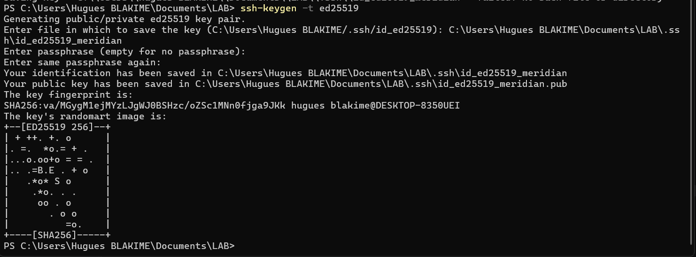

Authentification SSH par clé publique
Objectif

Mettre en place une authentification SSH par paire de clés entre le poste Windows et le serveur Debian srv-meridian-01, afin d'éviter l'utilisation du mot de passe lors des connexions SSH.

1. Génération de la paire de clés

Depuis PowerShell :

ssh-keygen -t ed25519 -f "$env:USERPROFILE\.ssh\id_ed25519_meridian"

Deux fichiers sont générés :

id_ed25519_meridian      # Clé privée - conservée sur Windows
id_ed25519_meridian.pub  # Clé publique

La clé privée ne doit jamais être copiée sur le serveur.

2. Installation de la clé publique

La clé publique a été ajoutée sur le serveur dans :

/home/essotom/.ssh/authorized_keys

Ce fichier contient les clés publiques autorisées pour le compte essotom.

3. Permissions

Le répertoire .ssh et le fichier authorized_keys doivent appartenir à l'utilisateur essotom :

sudo chown essotom:essotom /home/essotom/.ssh
sudo chown essotom:essotom /home/essotom/.ssh/authorized_keys

chmod 700 /home/essotom/.ssh
chmod 600 /home/essotom/.ssh/authorized_keys

Vérification :

ls -ld ~/.ssh
ls -l ~/.ssh/authorized_keys
4. Vérification de SSH

La configuration effective du serveur a été vérifiée avec :

sudo sshd -T | grep -E 'pubkeyauthentication|authorizedkeysfile'

Résultat :

pubkeyauthentication yes
authorizedkeysfile .ssh/authorized_keys .ssh/authorized_keys2

L'authentification par clé publique est donc activée.

5. Test depuis Windows

Connexion avec la clé privée :

ssh -i .\id_ed25519_meridian essotom@192.168.56.10

La connexion a été validée avec succès.

6. Incident rencontré

Lors du premier test, l'authentification par clé était refusée.

La vérification des permissions a montré que :

/home/essotom/.ssh → root:root
/home/essotom/.ssh/authorized_keys → essotom:essotom

Le propriétaire incorrect du répertoire .ssh empêchait SSH d'utiliser correctement la clé.

Le propriétaire a été corrigé :

sudo chown essotom:essotom /home/essotom/.ssh

Après correction des permissions, l'authentification par clé publique a fonctionné.

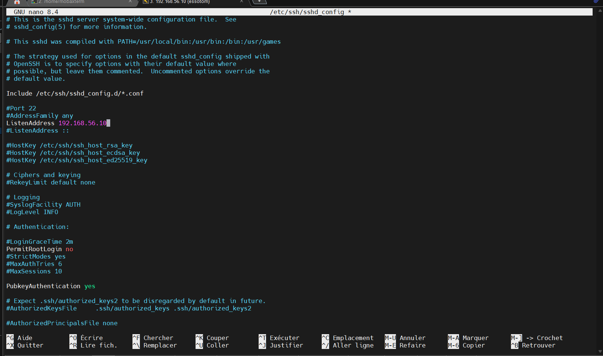

--- 

### Étape 5 : Mise en place de la bannière

Il existe des bannières liées au service SSH : la bannière avant l'authentification et celle après l'authentification. Pour configurer la bannière avant l'authentification, il faut créer un fichier qui contiendra le message de notre bannière comme suit :

```bash 

sudo nano /etc/ssh/banner

```

Dans notre cas notre message sera celui-ci 

```bash
************************************************************************
*                         ACCÈS RESTREINT                              *
*                                                                      *
* Serveur : srv-meridian-01                                            *
*                                                                      *
* Toute connexion est réservée aux utilisateurs autorisés.            *
* Toute activité peut être journalisée et contrôlée.                   *
*                                                                      *
* Toute tentative d'accès non autorisée est interdite.                 *
************************************************************************
```
Ensuite il faut préciser au service SSH où lire ce message. Nous allons éditer le fichier

```bash
sudo nano /etc/ssh/sshd_config
``` 
afin d'ajouter la ligne 

```bash
Banner /etc/ssh/banner
``` 
ensuite on valide la config avec la commande suivante 

```bash
sudo sshd -t

``` 
```bash
sudo systemctl reload ssh

``` 
--- 

### Étape 6 : Installation et configuration du pare-feu nftables

#### 1- Installation de nftables

```bash
sudo apt update && sudo apt install nftables

# Activation au démarrage et démarrage immédiat
sudo systemctl enable --now nftables

# Verification du statut 
sudo systemctl status nftables

# Version installée 
nft --version 

```
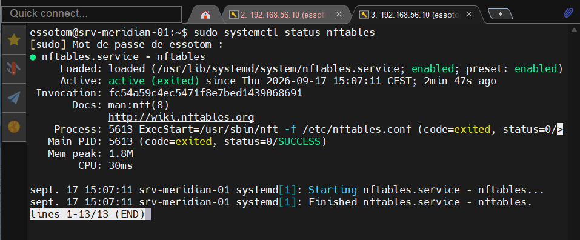

#### 2- Configuration des règles nftables

```bash

# D'abord on crée la table
sudo nft add table ip meridian

# Ensuite on crée les chaînes correspondant aux hooks input et output

sudo nft add chain ip meridian input { type filter hook input priority 0 \; }

sudo nft add chain ip meridian output { type filter hook output priority 0 \; }

# Politique par défaut : entrée refusée
sudo nft chain ip meridian input { policy drop \; }

# Pour finir on crée les règles correspondant aux exigences

# Autoriser le trafic sur l'interface de bouclage
sudo nft add rule ip meridian input iifname "lo" accept

sudo nft add rule ip meridian output oifname "lo" accept

# Autoriser SSH depuis le réseau 192.168.56.0/24 uniquement

sudo nft add rule ip meridian input ip saddr 192.168.56.0/24 tcp dport 22 accept

#  Autoriser les connexions établies et liées

sudo nft add rule ip meridian input ct state established,related accept

sudo nft add rule ip meridian output ct state established,related accept

# Validation de la configuration
sudo nft -c -f /etc/nftables.conf
sudo nft -f /etc/nftables.conf

# Installer et configurer les mises à jour de sécurité automatiques
sudo apt update
sudo apt install unattended-upgrades
