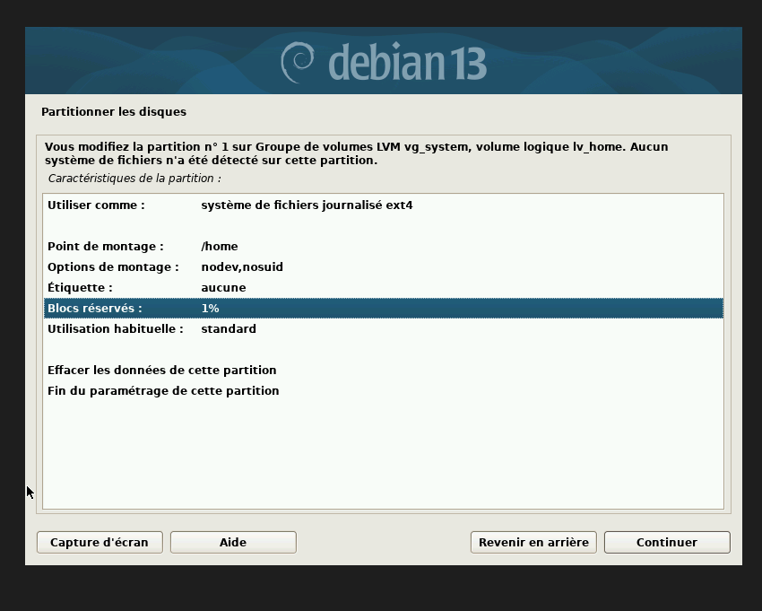
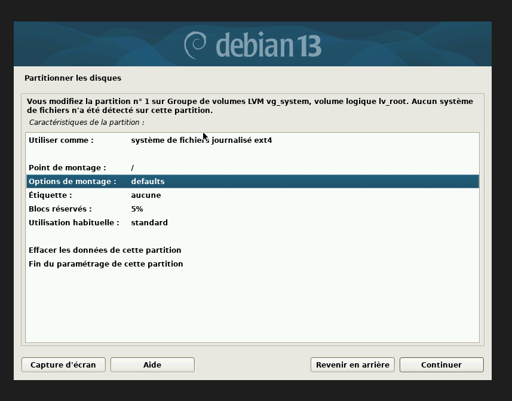
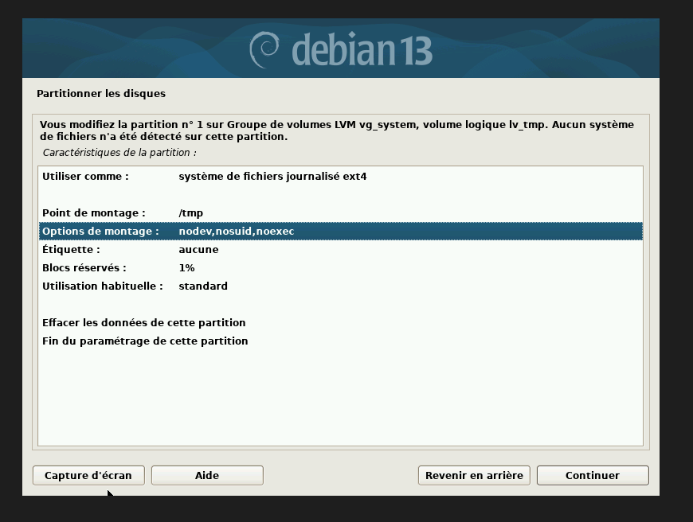
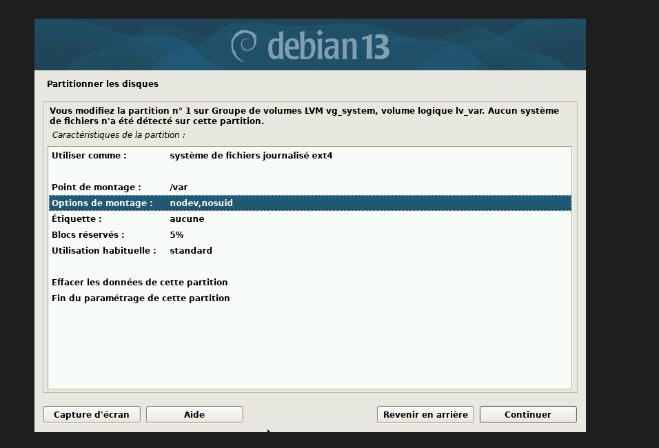
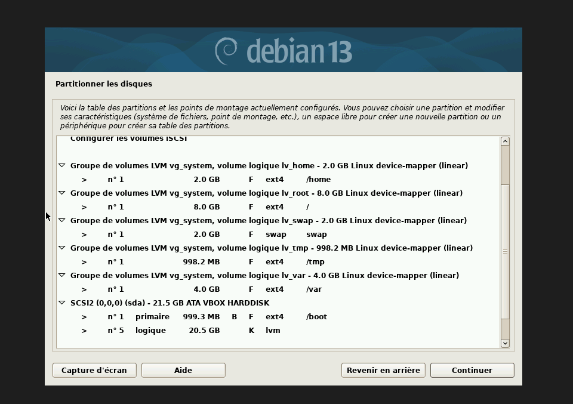
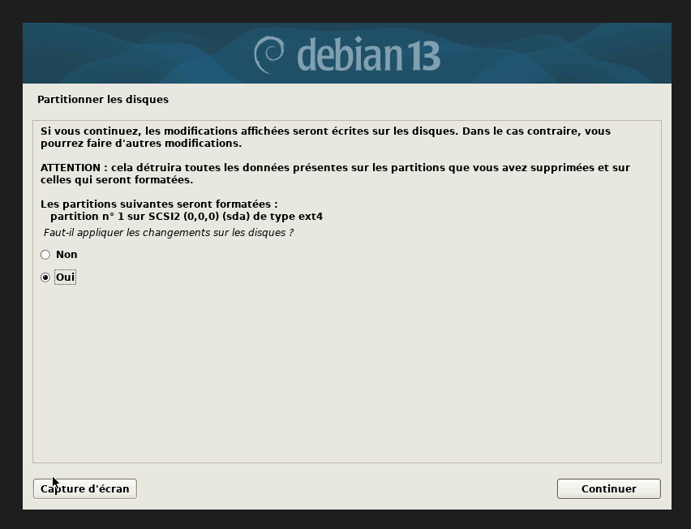

## Partitionnement du disque

Pour créer les volumes comme le demande le projet, nous avons utilisé la fonctionnalité de partitionnement manuel de l'installateur.
Nous obtenons alors ce premier rendu.

Ensuite nous allons configurer les points et les options de montage pour chaque disque. 

### lv_home 

Pour ce volume logique, nous avons retenu la configuration suivante : 

Dans un premier temps, le point de montage /home a été choisi, car il correspond à la fonction prévue pour ce volume, à savoir le stockage des données des utilisateurs.

Concernant les options de montage, nous avons sélectionné **nodev et nosuid**. L'option nodev indique au noyau Linux de ne pas interpréter les fichiers de périphériques présents sur ce système de fichiers. L'option nosuid, quant à elle, empêche l'utilisation des mécanismes Set-UID et Set-GID sur les fichiers présents sur ce volume. Ces deux options permettent ainsi de renforcer la sécurité de la partition /home.

Enfin, concernant le pourcentage de blocs réservés, nous avons volontairement retenu une valeur de 1 %. Ce choix s'explique par le fait que le remplissage de cette partition n'affecte pas directement le fonctionnement des composants essentiels du système. Une faible réserve reste néanmoins conservée afin de disposer d'un minimum d'espace disponible en cas de besoin.
### lv_root

Pour ce volume logique, nous avons retenu la configuration suivante :

Ici, nous configurons la partition racine (**/**). Contrairement à la partition /home, il est important de conserver un espace réservé afin de prévenir un remplissage complet du système de fichiers. Cela permet de maintenir un minimum d'espace disponible pour le bon fonctionnement du système, notamment pour les services essentiels, les fichiers journaux et les opérations d'administration.

### lv_tmp

La configuration de lv_tmp suit le même principe que celle de lv_home. Concernant les options de montage, nous avons toutefois ajouté une option supplémentaire : noexec (EX-09). Celle-ci empêche l'exécution de programmes depuis ce système de fichiers, ce qui permet de réduire les risques liés à l'exécution de fichiers malveillants ou non autorisés présents dans la partition /tmp.

### lv_var 

En ce qui concerne le volume logique lv_var, nous avons conservé un pourcentage de blocs réservés de 5 %. Ce choix permet de maintenir une réserve d'espace disponible sur la partition /var, notamment pour garantir le bon fonctionnement des services et éviter qu'un remplissage complet du système de fichiers n'entraîne des dysfonctionnements.

### /boot

La partition /boot, isolée du reste du système de fichiers, a été configurée avec /boot comme point de montage. Un pourcentage de blocs réservés de 2 % a également été défini afin de conserver un espace disponible pour les fichiers nécessaires au démarrage du système et d'éviter qu'un remplissage complet de la partition ne compromette le processus de démarrage.

La capture ci-dessous montre un résumé du partitionnement avant validation :

Validation du partitionnement :

