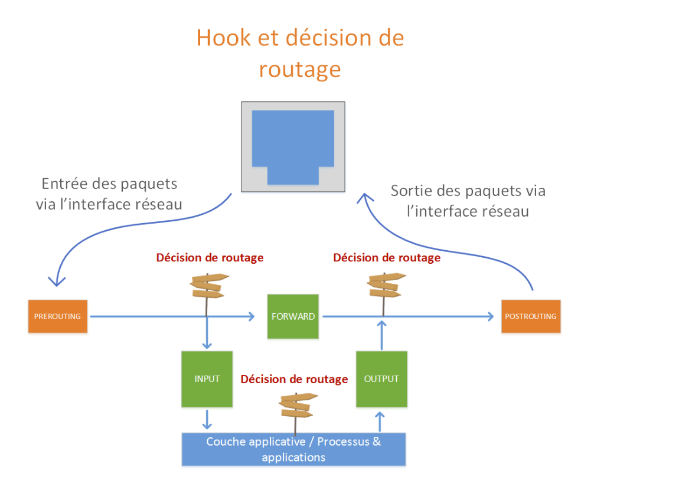
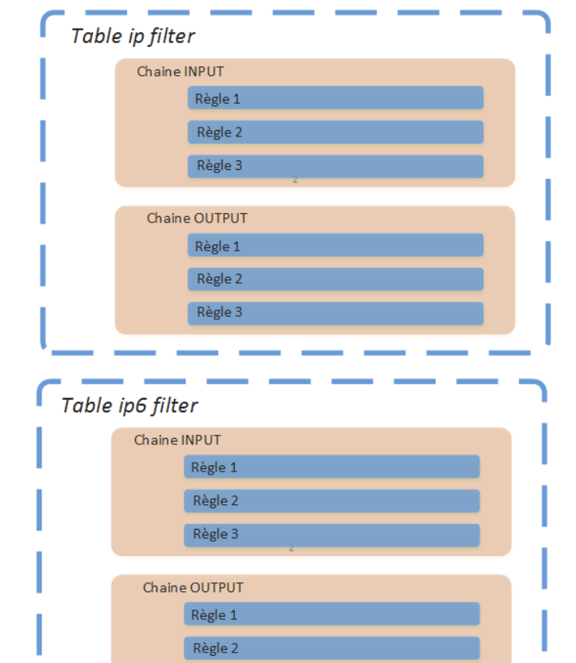

# Recherches - Projet 01 : Socle serveur

Réponses aux 6 zones de recherche imposées par le cahier des charges ([README.md](../README.md), section 6).

---

## 1. PV, VG, LV : les trois niveaux d'abstraction de LVM

LVM empile trois couches. Le **PV** (physical volume) est un disque ou une partition initialisé pour LVM avec `pvcreate` : c'est la brique physique. Le **VG** (volume group) regroupe un ou plusieurs PV dans un même pot commun d'espace disponible, créé avec `vgcreate` - dans notre cas `vg_system`. Le **LV** (logical volume), enfin, est une « partition virtuelle » découpée dans ce pot avec `lvcreate` : c'est lui qu'on formate et qu'on monte, exactement comme une partition classique.

Isoler `/var` sur son propre LV n'est pas cosmétique. `/var` contient les journaux, le cache d'apt, les files d'attente - tout ce qui grossit de façon imprévisible. Si `/var` partageait le même volume que `/`, un service qui devient bavard et remplit les logs pourrait saturer la racine du système entière : plus de place pour écrire dans `/etc`, pour que sudo journalise quoi que ce soit, parfois même pour ouvrir une session. En isolant `/var`, un remplissage reste contenu : les services qui écrivent dedans se dégradent, mais le système reste pilotable - on peut toujours se connecter en SSH et nettoyer. C'est exactement l'incident qu'EX-08 anticipe en imposant de garder de l'espace libre dans `vg_system`.

## 2. `/boot` hors LVM

Cette règle vient d'un problème d'œuf et de poule : au tout début du démarrage, GRUB doit lire le noyau et l'initrd directement sur le disque, avant que Linux - et donc le pilote LVM - ne soit chargé. Les premières versions de GRUB ne savaient lire que des systèmes de fichiers simples sur des partitions classiques ; elles étaient incapables de comprendre la couche d'abstraction LVM. D'où la règle : `/boot` doit rester sur une partition « brute », en dehors de LVM.

Depuis GRUB2, un module `lvm` existe et sait lire des volumes logiques simples (linéaires, sans RAID ni chiffrement empilés dessus). La contrainte s'est donc assouplie, mais elle reste fragile dès que le schéma se complique (LVM sur RAID logiciel, volumes thin-provisionnés, etc.), et beaucoup de distributions continuent par prudence de recommander un `/boot` séparé. Nous avons choisi de suivre cette prudence plutôt que de parier sur la compatibilité du module.

## 3. Empreinte de clé SSH

Au premier contact, SSH affiche l'empreinte de la clé hôte du serveur et demande de confirmer qu'on lui fait confiance. Ce n'est pas nous qui sommes authentifiés à ce moment-là : c'est le serveur. L'empreinte sert à vérifier qu'on parle bien à `srv-meridian-01` et pas à une machine qui s'interpose entre nous et lui (attaque de type « homme du milieu »).

Répondre « yes » sans vérifier revient à faire une confiance aveugle : si un attaquant se trouvait effectivement au milieu, on viendrait de valider sa clé comme si c'était la bonne, et tout ce qui suit passerait par lui sans qu'on le sache. La bonne pratique est donc de récupérer l'empreinte attendue par un canal différent de la connexion SSH elle-même - typiquement directement sur la console de la VM, avant toute connexion à distance :

```bash
ssh-keygen -lf /etc/ssh/ssh_host_ed25519_key.pub
```

On compare ensuite cette empreinte à celle affichée par le client lors de la première connexion.

## 4. `sudo -i` vs `sudo su -` vs `su -`

- **`su -`** bascule sur root en demandant **le mot de passe de root**, et ouvre un vrai shell de connexion avec l'environnement de root - mais ne passe pas du tout par sudo. Résultat : rien n'est journalisé dans `/var/log/sudo.log`, et surtout ça suppose de connaître un mot de passe root, ce qu'on cherche justement à éviter (EX-04).
- **`sudo su -`** passe par sudo (nos droits sont vérifiés, et l'appel initial « sudo su - » est journalisé), avec **notre propre mot de passe**. Mais une fois dans le shell root ouvert par `su`, plus aucune commande n'est journalisée individuellement par sudo : on est sorti de son contrôle.
- **`sudo -i`** reste entièrement piloté par sudo : il simule une connexion root (environnement propre, comme un vrai login) tout en s'authentifiant avec **notre propre mot de passe**, dans le cadre de sudo.

Pour respecter EX-15 (toute commande passée par sudo doit être journalisée), le plus cohérent reste d'utiliser `sudo <commande>` au cas par cas plutôt que d'ouvrir un shell root prolongé - `su -` en particulier est à proscrire puisqu'il contourne sudo entièrement.

## 5. Gestion du réseau sous Debian

Sur une installation serveur Debian fraîche (netinst, sans bureau), c'est **ifupdown** qui gère le réseau par défaut, via `/etc/network/interfaces` - pas NetworkManager (pensé pour les postes de bureau), ni systemd-networkd (présent sur le système mais pas activé par défaut sur une installation serveur classique).

Pour le vérifier avec certitude plutôt que de le supposer :

```bash
systemctl status networking          # service d'ifupdown
systemctl status systemd-networkd    # doit être inactif/absent
systemctl status NetworkManager      # idem
```

Si deux de ces gestionnaires tournent en même temps sur la même interface, ils se marchent dessus : chacun peut tenter de la configurer à sa façon, relancer des baux DHCP différents, ou réécrire la table de routage l'un après l'autre - ce qui se traduit par une connectivité qui saute de façon intermittente et des adresses IP qui changent sans raison apparente. C'est pour ça que Debian n'en active jamais deux à la fois par défaut.

## 6. Nommage prédictible des interfaces

`enp0s3` vient du schéma de nommage prédictible de systemd, qui a remplacé l'ancien `eth0`/`eth1`. Avec l'ancien schéma, le nom dépendait de l'ordre dans lequel le noyau détectait les cartes au démarrage - deux cartes pouvaient échanger leurs noms d'un redémarrage à l'autre. Le nouveau schéma encode à la place la position physique de la carte :

- **en** : Ethernet
- **p0** : bus PCI numéro 0
- **s3** : slot 3 sur ce bus

`enp0s3` signifie donc littéralement « carte Ethernet, bus PCI 0, slot 3 ». VirtualBox/KVM reproduisent une topologie PCI virtuelle stable : la même carte virtuelle obtient donc toujours le même nom d'un démarrage à l'autre, ce qui répond à EX-13.

---

## Recherche complémentaire : le choix du pare-feu

Cette section ne fait pas partie des 6 questions imposées, mais documente le raisonnement derrière le choix de nftables pour l'exigence EX-21.

### Introduction

Le rôle des pare-feux est de réduire la surface d'exposition d'un système en n'autorisant que les communications nécessaires aux services effectivement utilisés.
Sous Linux, le filtrage réseau repose historiquement sur le sous-système Netfilter, intégré au noyau Linux. Parmi les outils les plus utilisés figurent **iptables**, **nftables**, **UFW** et **firewalld**. Ces solutions ne se situent toutefois pas exactement au même niveau : certaines constituent directement des interfaces de configuration du mécanisme de filtrage, tandis que d'autres fournissent une couche d'abstraction destinée à simplifier son administration.

### Étude comparative des pare-feux Linux

| Solution      | Points forts                                                         | Limites                                                             | Usage recommandé                          |
| ------------- | --------------------------------------------------------------------- | -------------------------------------------------------------------- | ----------------------------------------- |
| **nftables**  | Moderne, flexible, IPv4/IPv6 unifiés, sets/maps, automatisation       | Syntaxe plus complexe                                                 | Serveurs Linux et configurations avancées |
| **iptables**  | Très répandu, nombreuses documentations et configurations existantes  | Technologie historique, moins adaptée aux nouvelles infrastructures  | Compatibilité et systèmes legacy          |
| **UFW**       | Simple, rapide à configurer, facile à apprendre                       | Moins de contrôle sur les configurations avancées                    | Serveurs simples et débutants             |
| **firewalld** | Gestion dynamique, zones réseau, support IPv4/IPv6                    | Plus abstrait et plus complexe qu'UFW                                 | Infrastructures dynamiques et multi-zones |

### Choix pour Debian

Pour un **nouveau serveur Debian 13**, **nftables est le choix retenu**. Debian le considère comme son framework de pare-feu par défaut et recommandé depuis Debian 10. Il permet de gérer directement Netfilter avec une configuration moderne et précise.

Ce choix est motivé par plusieurs éléments :

* **architecture moderne**, destinée à remplacer l'ancien modèle iptables ;
* **gestion unifiée d'IPv4 et IPv6** grâce notamment à la famille `inet` ;
* **grande granularité** dans la définition des règles ;
* prise en charge native des **sets et maps** ;
* possibilité de stocker les règles dans un fichier et de les **versionner avec Git** ;
* bonne adaptation à l'**automatisation et à l'Infrastructure as Code**.

À l'inverse, **UFW** est privilégié lorsque la simplicité constitue le principal objectif, tandis que **firewalld** est particulièrement intéressant dans les environnements nécessitant une gestion dynamique par zones. **iptables** reste surtout pertinent pour la compatibilité avec les infrastructures existantes.

**Conclusion** - Dans le cadre du projet Meridian, **nftables** a donc été retenu comme solution de pare-feu. Il offre un bon compromis entre sécurité, contrôle, maintenabilité et évolutivité, tout en étant pleinement cohérent avec l'écosystème Debian.



