# Validation -`srv-meridian-01`

|                             |                                         |
| --------------------------- | --------------------------------------- |
| **Date de recette**         | 2026-09-17                              |
| **Opérateur**               | Essotom                                 |
| **Système testé**           | Debian 13.x, noyau 6.12.105+deb13-amd64 |
| **Version de la procédure** | `installation.md` v1.0                  |
| **Résultat global**         | Conforme     |

---

## 1. Matrice de traçabilité

| Test                         | Exigences couvertes | Résultat |
| ---------------------------- | ------------------- | -------- |
| 6.1 Partitionnement          | EX-05 → EX-09       | OK       |
| 6.2 Réseau                   | EX-10 → EX-13       | OK       |
| 6.3 Accès SSH                | EX-17 → EX-20       | OK       |
| 6.4 Privilèges               | EX-14 → EX-16       | OK       |
| 6.5 Pare-feu et mises à jour | EX-21, EX-22        | OK       |
| 6.6 Résilience               | EX-23               | OK       |
| 6.7 Reconstruction           | O-08                | OK       |

---

## 2. Partitionnement

### `lsblk`

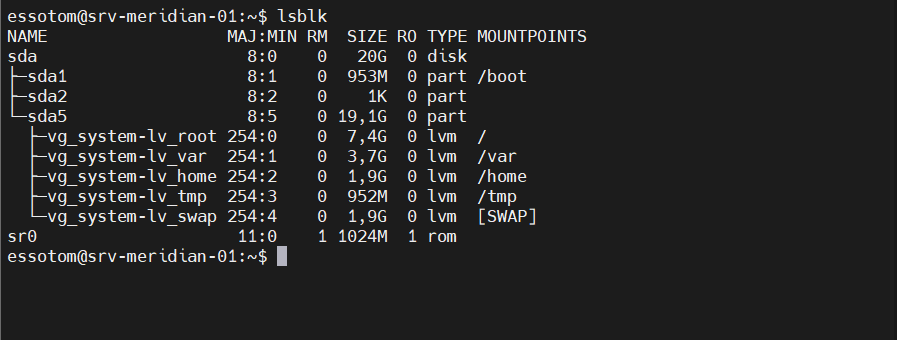

### `sudo vgs`

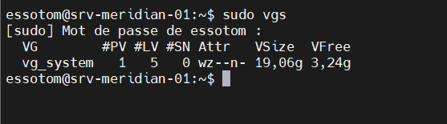

**Vérification** - `VFree` ≥ 2,00g → oui (EX-08)

### `sudo lvs`

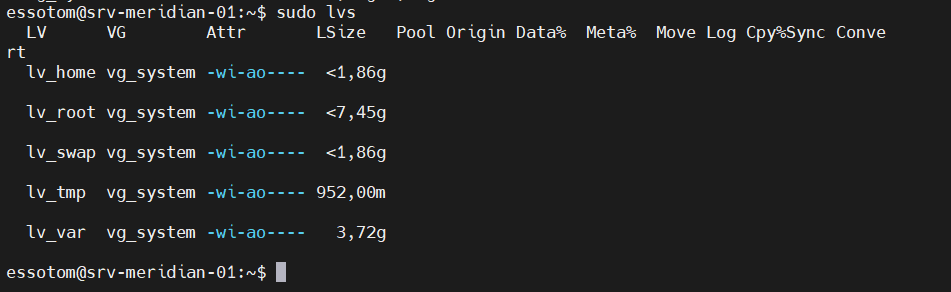

### `df -h`

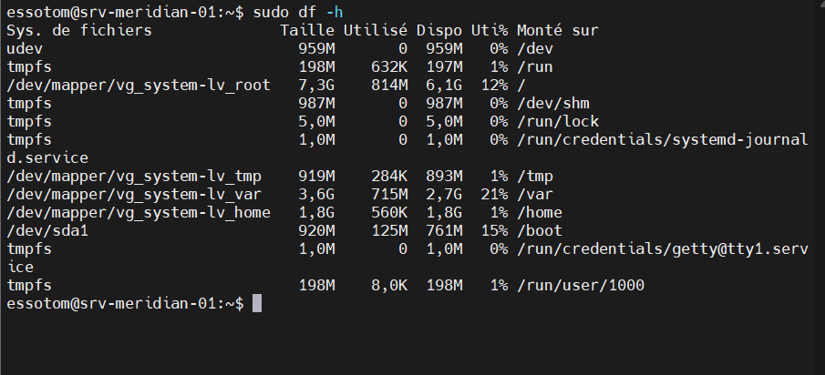

### `findmnt --real -o TARGET,SOURCE,FSTYPE,OPTIONS`

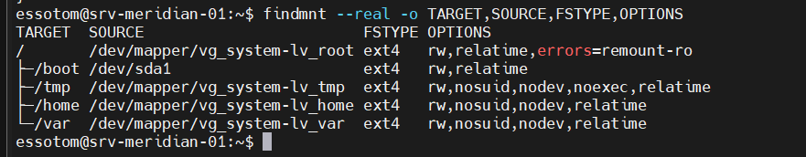

**Vérification** - options `nodev,nosuid,noexec` présentes sur `/tmp`

### Test `noexec` sur `/tmp` *(attendu : échec)*

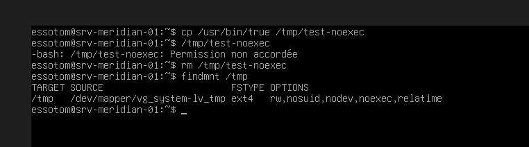

**Verdict** : OK

---

## 3. Réseau

### `ip -brief address show`

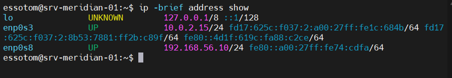

### `ping -c3 deb.debian.org`

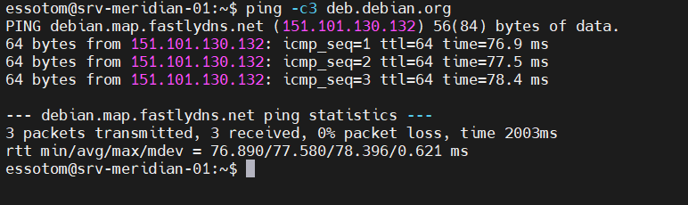

### `getent hosts srv-meridian-01.meridian.lan`

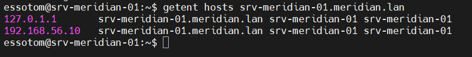

### `hostnamectl`

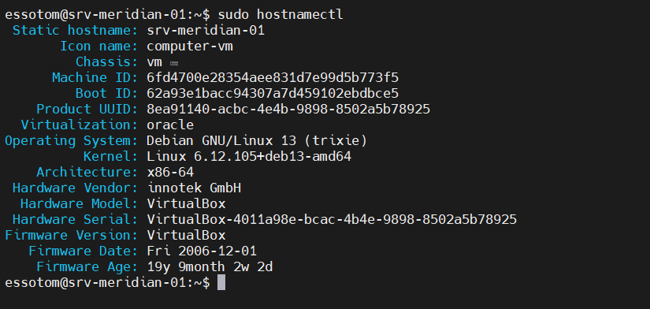

---

## 4. Accès SSH

> Les trois premiers tests doivent **échouer**. Un échec attendu est un test réussi : c'est le message d'erreur qui constitue la preuve, pas son absence.

### T-01 - Connexion root refusée *(attendu : échec)*

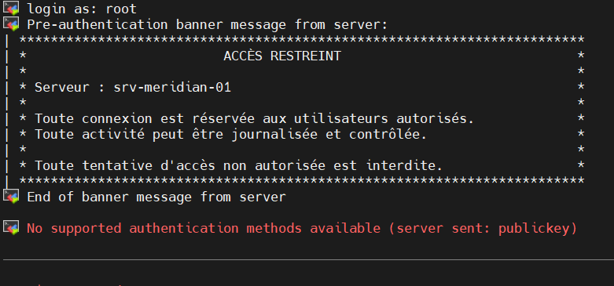

**Verdict** : Accès refusé

### T-02 - Authentification par mot de passe refusée *(attendu : échec)*

Test refait avec le compte `essotom`.

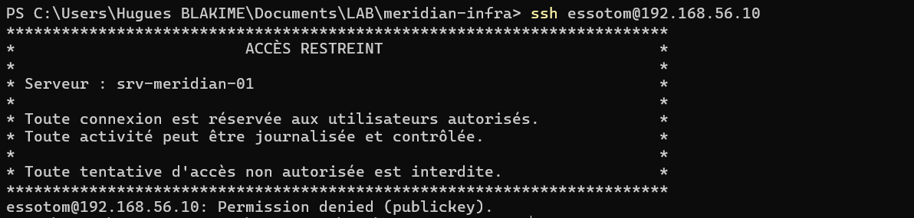

**Verdict** : OK

### T-03 - Pas d'écoute sur l'interface NAT *(attendu : échec)*

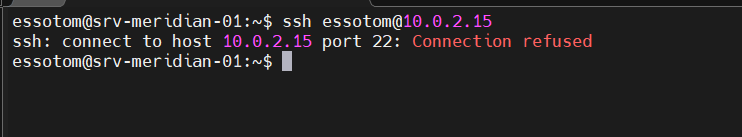

**Verdict** : OK

### T-04 - Connexion par clé *(attendu : succès, sans mot de passe)*

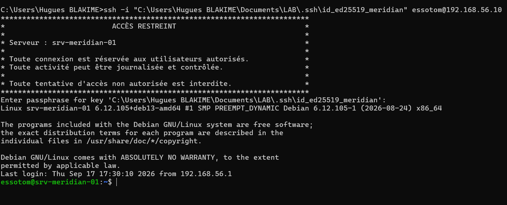

**Verdict** : conforme (EX-17, EX-20)

### `ss -tlnp | grep :22`

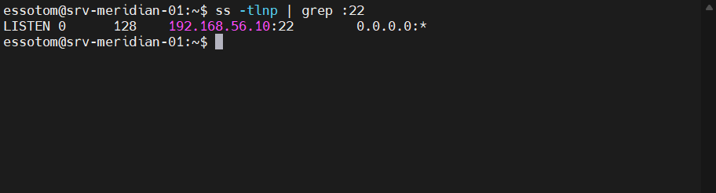

**Vérification** - écoute limitée à `192.168.56.10:22` → conforme (EX-19)

### `sudo sshd -T`

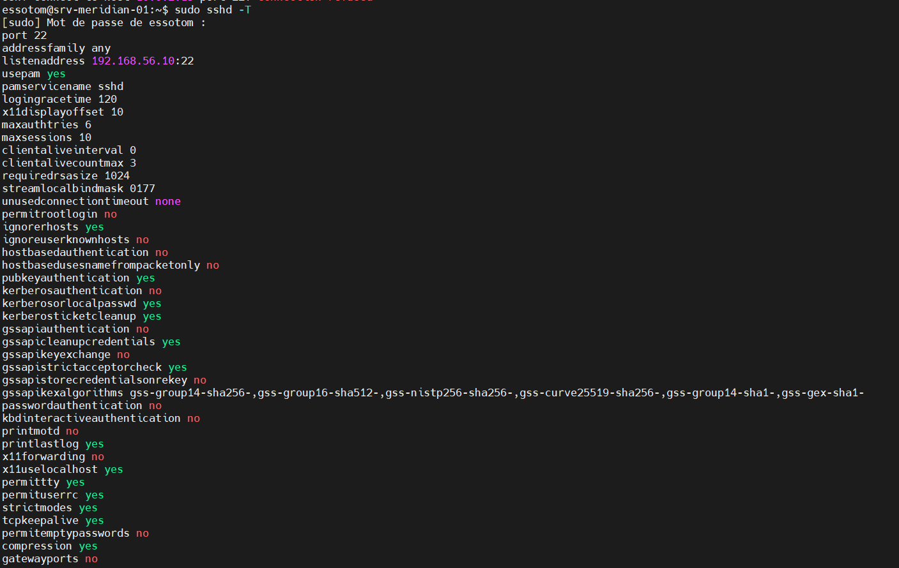

**Vérification** - `permitrootlogin no`, `passwordauthentication no`, `x11forwarding no`, `listenaddress 192.168.56.10` → OK (EX-18, EX-19)

---

## 5. Privilèges

### `sudo -l`

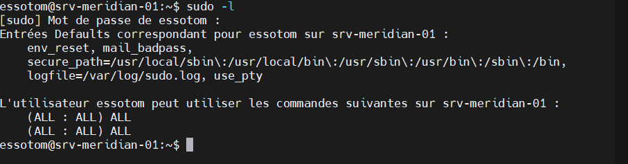

### `sudo tail -n5 /var/log/sudo.log`

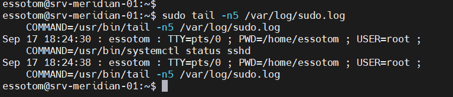

**Vérification** - la commande précédente figure bien dans le journal → conforme (EX-15)

---

## 6. Pare-feu et mises à jour

### `sudo nft list ruleset`

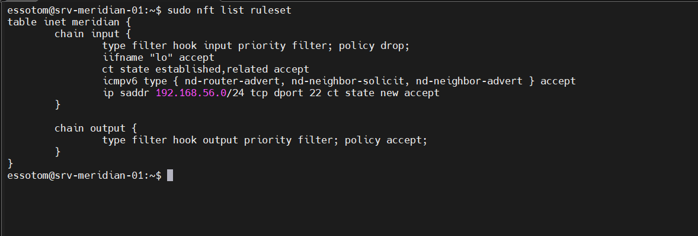

**Vérification** - table `inet meridian`, politique `drop` en entrée, loopback autorisé, SSH limité à `192.168.56.0/24`, connexions établies acceptées, ICMPv6 `nd-neighbor-solicit`, `nd-neighbor-advert`, `nd-router-advert` acceptés → OK

### `systemctl is-enabled unattended-upgrades`

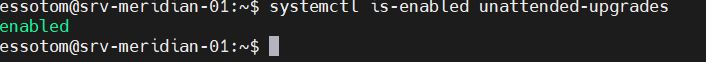

---

## 7. Résilience au redémarrage

### `systemctl --failed`

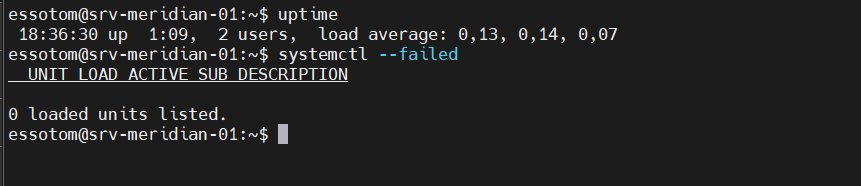

---
